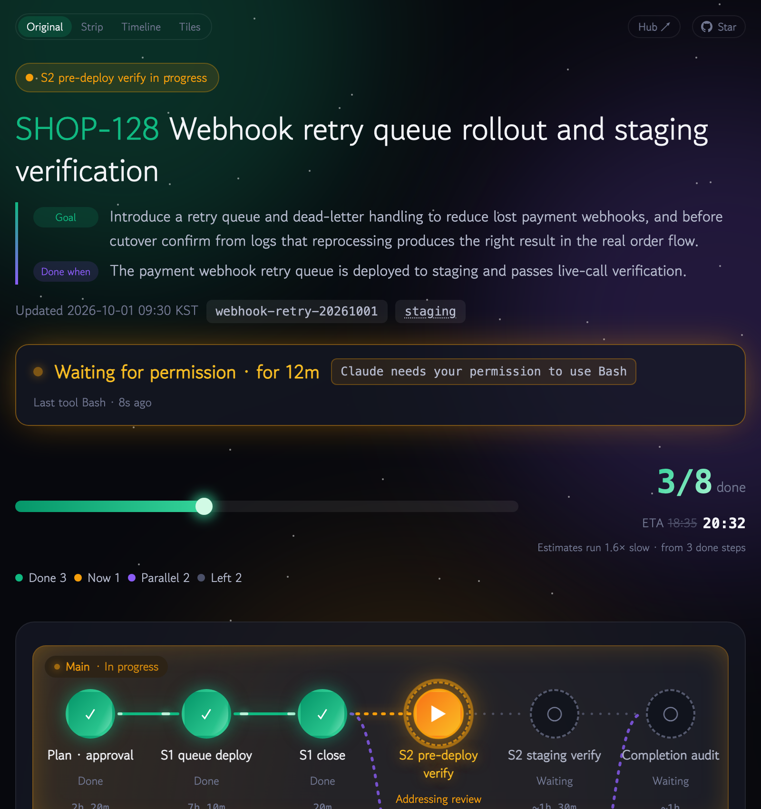
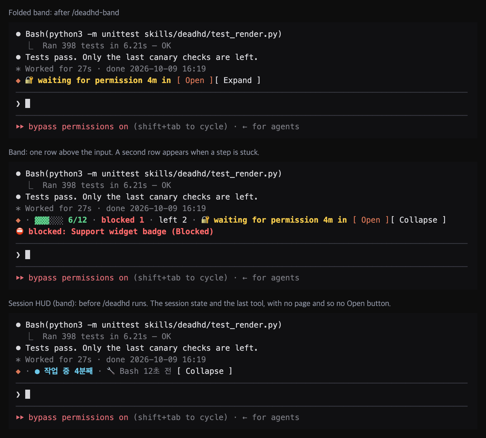
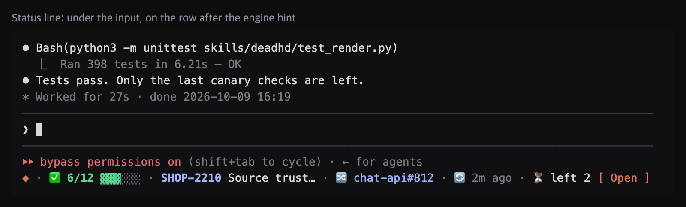
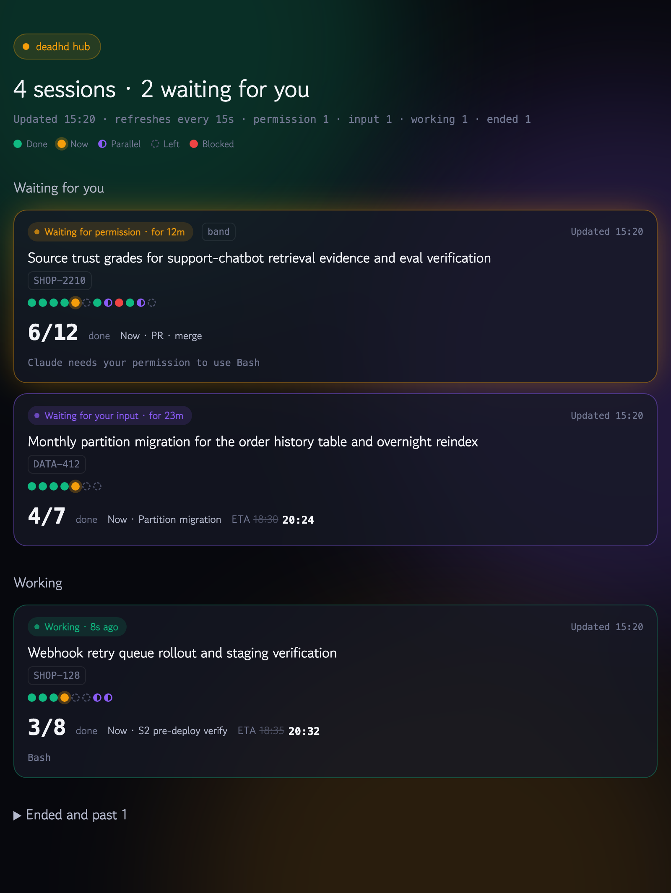
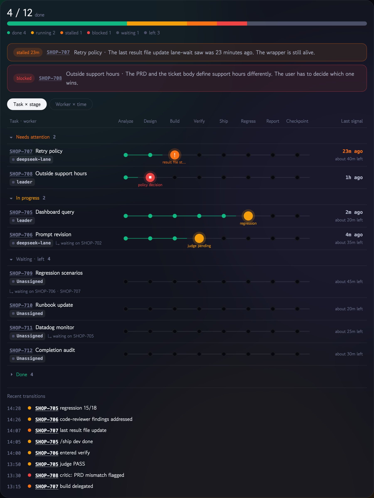

<h1 align="center"></h1>

<p align="center"><a href="README.md">한국어</a> · <b>English</b></p>

<p align="center"><b>dead + ADHD</b>: A Claude Code progress skill for beating ADHD</p>

<p align="center">
  <a href="https://github.com/lcalmsky/deadhd/releases/latest"></a>
  <a href="LICENSE"></a>
  
  
</p>

<p align="center">
  <a href="#quick-start">Quick start</a> ·
  <a href="#features">Features</a> ·
  <a href="#installation">Installation</a> ·
  <a href="#usage">Usage</a> ·
  <a href="#settings">Settings</a> ·
  <a href="#how-it-works">How it works</a>
</p>

When you run several Claude Code sessions at once, it is easy to lose track of how far a session got while you were looking at another one. deadhd opens the steps a session has completed, the step in progress, and the remaining steps as a checklist page and keeps updating it while the work runs. You can check progress from one page without scrolling back through the terminal log.

<p align="center"></p>

Built for terminal apps with an in-app browser, such as [Orca](https://onorca.dev), keeping the progress page open in a panel beside the terminal. Without Orca you can open it in the system browser or the Claude desktop app's in-app browser, and in Claude Code you can also watch the same progress as a line above or under the prompt instead of the page.

## Quick start

Install the plugin in Claude Code.

```
/plugin marketplace add lcalmsky/deadhd
/plugin install deadhd@deadhd
```

In the session that started a long task, type `/deadhd:deadhd`. The first run asks once for the open location, the display, the theme, and the font, and from then on Claude updates the page whenever a step's state changes. Instead of the command, you can ask in plain words, e.g. "show progress" or "show me a checklist".

Other install methods are in [Installation](#installation).

## Features

| Feature | What it does |
|---|---|
| [Progress page](#progress-page-and-status-band) | Shows completed, in-progress, and remaining steps as a flow diagram and cards, each with its supporting file paths, PRs, commits, and test pass counts |
| [Status band](#progress-page-and-status-band) | Tells you session state at the top of the page, such as waiting for permission, waiting for input, the last tool, and compactions |
| [Calibrated ETA](#waiting-for-you-notifications-and-calibrated-eta) | Accumulates a history of first estimates and actual durations, and from three records on shows a calibrated completion time alongside |
| [Three display views](#display-views) | Pick a browser page, a band above the prompt, or a status line under the prompt |
| [Four view modes](#view-modes) | Switch the same progress between Original, Strip, Timeline, and Tiles |
| [Hub](#hub) | Gathers this machine's sessions on one page, sorted by state |
| [Lane board](#lane-board) | Shows work units running in parallel as a task × stage table |
| [Ten themes and twelve fonts](#themes-and-fonts) | Pick the page theme and the heading font |

### Progress page and status band

Typing `/deadhd` in the working session opens a page that lays out completed, in-progress, and remaining steps as a flow diagram and cards. When work runs long, a status band appears at the top of the page telling you what the session is waiting for, and the plugin hooks keep it fresh, not the model.

<p align="center"></p>

### Display views

The same progress can be shown three ways. The band and the status line are shown inside the Claude Code terminal without opening a page.

| Display | Where | Layout |
|---|---|---|
| `band` | One line above the prompt | Compresses the done count, a progress bar, the step in progress with its elapsed time, and only the blocked and left counts. It opens no browser tab, so it is the lightest of the three |
| `statusline` | One line under the prompt | Carries the ticket key and title, the pull request of the step in progress, the next step, the completion estimate, the last update, background tasks, and compactions |
| `html` | The browser page | The progress page above |

**The band** grows a second row when a step is stuck or the session waits. `/deadhd-band` folds it back to the count with the `Open` and `Expand` buttons.

<p align="center"></p>

**The status line** carries the same state file with more fields. The ticket key and the pull request of the step in progress are links you can press. When the row is wider than the terminal, the title is cut first and gets a `…`; if it still does not fit, the less important fields go first, and the wait state and the done count always stay. The `Open` button at the end of the row opens the page.

<p align="center"></p>

Pick one in `/deadhd setup`, or change it with `/deadhd --view <value>`. The order is the `--view` value, the value already recorded in the session's state file, the saved setting, and `html` when there is none, so one run with `--view band` keeps that session on the band.

The band and the status line are drawn by the deadhd plugin's mod (`skills/deadhd/hooks/register.tsx`), which reads the same state file the skill writes. They are **Claude Code only**; outside Claude Code (Codex `$deadhd`, say) the skill does not ask and works as `html`.

<details>
<summary>How the band and the status line handle the page file</summary>

Under `band` and `statusline` the page file is not written straight away. The state summary and the hub are rewritten on every update; the page is written when it is first opened (`/deadhd-open`, the `Open` button) and from then on with every update. A session with no page yet shows its display name (`band`/`status line`) in the hub instead of a link. A command that does not match the current display answers in one line with how to switch.

</details>

### View modes

The buttons at the top left of the page switch the same progress between four views. Where the page is narrow, such as the Claude artifact panel or a split Orca tab, the compact views are easier to read at a glance.

| View | Layout |
|---|---|
| Original | The default page with the flow diagram and a card for every step |
| Strip | Shrinks the step flow to one row of dots and expands only the card for the step in progress. The other steps are folded into done, parallel, and left groups |
| Timeline | Stacks the steps one per row, each with its finish time or estimate. The step in progress is shown as a card |
| Tiles | Leads with numbers (steps done, time left on the current step, expected completion) and shows each step's state as a segmented bar |

<p align="center"></p>

Picking a compact view shows the `Auto`, `Landscape`, and `Portrait` buttons. `Auto` uses the landscape layout when the tab is wider than 5:4 and at least 760px wide, and the portrait layout otherwise, and it re-lays out as soon as you resize the tab. The chosen view and layout survive the 15-second auto-refresh. The browser draws a view from the data already in the page, so switching views adds no token cost.

### Hub

One page that gathers the sessions running on this machine. Open it with `/deadhd hub`, or with the `Hub ↗` button at the top right of a session page. A tile carries the status badge, the title and key, a per-step mini strip, `6/12 done`, what is running now, and the completion estimate.

<p align="center"></p>

- Sorted permission > no signal > input > working > no hooks > done > ended > past sessions, and within a state the session that has waited longest comes first.
- Pressing a tile moves to that session's page in the same tab, and the `Hub ↗` button on a session page returns to the hub in the same tab.
- Only sessions that write a state file (1.8.0 and later) are gathered. A session not updated for more than 24 hours folds into "Ended and past".

### Lane board

When four or more work units run in parallel, such as the subtasks of an epic, filling the data's `board` adds a task × stage table below the page. Each lane shows its stage, worker, last signal, time left, and ticket transitions on one row, with a summary of how many are done, running, stalled, blocked, waiting, or left.

<p align="center"></p>

The browser measures how long a lane has been quiet past its `stallAfter` (15 minutes by default), so a lane you stop updating still shows up as stalled in the attention band. A harness session that splits work across workers uses the same format as a plain session that hands work to a default subagent. A session without `board` draws only the flow.

### Themes and fonts

Nine themes in a 3×3 gallery. You can see a multi-lane flow, blocked work, a completion estimate that crosses midnight, and a state where every step is done. `system` is left out of the gallery because it follows the operating system's setting.

<p align="center"></p>

Pick a default with `/deadhd setup`, or change it for one run with `/deadhd --theme <theme>` or `/deadhd --font <preset>`.

<details>
<summary>Ten themes</summary>

| Value | Behavior |
|---|---|
| `system` | Follows the operating system's light/dark setting (recommended) |
| `light` | Always the light theme |
| `dark` | Always the dark theme (Aurora) |
| `neon` | Cyberpunk neon: near-black violet with cyan, magenta, and fluorescent yellow |
| `synthwave` | Synthwave sunset: deep violet over a pink-and-orange retro sunset |
| `matrix` | Matrix terminal: green monochrome on black, every glyph monospaced |
| `nord` | Nord arctic: a calm palette that is easy on the eyes over a long session |
| `paper` | Paper notebook: a warm paper-texture light theme with a serif heading |
| `sakura` | Sakura: a cherry-blossom pink light theme with a handwritten heading |
| `ink` | Ink: pure white on pure black. States are told apart by fill, outline, and hatching instead of color |

</details>

<details>
<summary>Twelve heading font presets</summary>

A preset bundles the family, weight, and letter spacing, and the default `default` keeps the heading font the theme already sets. The body font does not change.

| Value | Family | Weight · letter spacing |
|---|---|---|
| `default` | The theme's own font | Follows the theme |
| `pretendard` | Pretendard Variable | 800 · -0.03em |
| `noto-sans` | Noto Sans KR | 900 · -0.03em |
| `plex-sans` | IBM Plex Sans KR | 700 · -0.02em |
| `gothic-a1` | Gothic A1 | 900 · -0.03em |
| `nanum-gothic` | Nanum Gothic | 800 · -0.02em |
| `noto-serif` | Noto Serif KR | 900 · -0.02em |
| `nanum-myeongjo` | Nanum Myeongjo | 800 · -0.02em |
| `hahmlet` | Hahmlet | 900 · -0.02em |
| `gowun-batang` | Gowun Batang | 700 · -0.01em |
| `do-hyeon` | Do Hyeon | 400 · -0.04em |
| `black-han-sans` | Black Han Sans | 400 · 0 |

</details>

## Installation

All you need is [Claude Code](https://code.claude.com) and `python3` (standard library only). Use only one of the three methods.

| Method | Invocation name | Status band hooks |
|---|---|---|
| [Plugin](#install-as-a-plugin) (recommended) | `/deadhd:deadhd` | Included |
| [Skill folder](#install-as-a-skill-folder) | `/deadhd` | [Register manually](#registering-hooks-manually) |
| [Orca share link](#orca-install) | `/deadhd` | [Register manually](#registering-hooks-manually) |

### Install as a plugin

```
/plugin marketplace add lcalmsky/deadhd
/plugin install deadhd@deadhd
```

### Install as a skill folder

```bash
git clone https://github.com/lcalmsky/deadhd.git
cp -r deadhd/skills/deadhd ~/.claude/skills/
```

Because `skills/deadhd/.claude-plugin/` is copied along, the folder is auto-loaded as the `deadhd@skills-dir` plugin from the next session on, which is what draws the band and the status line. The command hooks that maintain the status band do not come along.

> [!WARNING]
> Do not use the plugin install and the skill folder install together. With both in place the `deadhd` plugin is loaded twice: the same commands, the same state key, and two timers over one state file.

<a id="orca-install"></a>

### Install from Orca

If you use [Orca](https://onorca.dev), open the [share link](https://share.onorca.dev/skills/share/shr_fff4656cd0eb2b802d3826cd234e8637705e641a15c81eec) and press `Open in Orca`. Orca lets you review the included files and choose where to install.

> [!NOTE]
> An Orca share link is a frozen bundle of the files uploaded at publish time. The current link contains v1.12.0, and releases after that are not reflected. For the latest version, install via the plugin or the skill folder.

### Update

| Install method | How to update |
|---|---|
| Plugin | Auto-update is off by default for third-party marketplaces. In `/plugin`, select deadhd and press **Update now**, or run `claude plugin update deadhd@deadhd`. Turning on **Enable auto-update** for the deadhd marketplace in the Marketplaces tab of `/plugin` installs new versions automatically. After updating, run `/reload-plugins` or start a new session |
| Skill folder | `git pull` in the cloned repository, then copy `skills/deadhd` again |
| Orca | A share link is a fixed copy from publish time, so reopening it does not install a new version |

## Usage

| Input | Behavior |
|---|---|
| `/deadhd` | Opens the progress page in a browser tab (same as `-h`) |
| `/deadhd -o` | Publishes as an Orca artifact (a web page with a shareable link). Requires an orca CLI login; falls back to a browser tab on failure |
| `/deadhd -c` | Publishes as a Claude artifact |
| `/deadhd setup` | Chooses the default open location, display, theme, and font again |
| `/deadhd hub` | Opens the hub page that gathers this machine's sessions |
| `/deadhd --open <mode>` | Opens in a different location for this run only |
| `/deadhd --view <display>` | Draws in a different display for this run only |
| `/deadhd --theme <theme>` | Renders with a different theme for this run only |
| `/deadhd --font <preset>` | Renders this run with a different heading font |
| `/deadhd off` | Stops updating the page |

While the band or the status line is showing in Claude Code:

| Input | Behavior |
|---|---|
| `/deadhd-band` | Folds or opens the band above the prompt |
| `/deadhd-statusline` | Folds or opens the status line under the prompt |
| `/deadhd-open` | Renders the progress page and opens it in a browser |

## Settings

On the first run, it asks once for the open location, the display, the theme, and the font, and the chosen values are reused from the next run on. `/deadhd setup` lets you choose them again at any time. The config file is `~/.config/deadhd/config.json`, created under `XDG_CONFIG_HOME` when that is set.

The open location uses these values.

| Value | Behavior |
|---|---|
| `auto` | Opens an Orca tab when running inside Orca, otherwise the system browser |
| `orca` | Opens an Orca tab when the `orca` command is available |
| `browser` | Skips Orca and opens the system browser |
| `desktop` | Does not open the page; prints only the path. Press that path in the Claude desktop app to open it in the in-app browser panel. You can press the printed http address instead |

The display is one of `band` (recommended), `statusline`, and `html` ([Display views](#display-views)). The theme and font values are in [Themes and fonts](#themes-and-fonts).

If `~/.config/deadhd/writing-rules.md` exists, page sentences follow that file's rules. Without it, the default rules apply (noun-phrase titles, field terminology, no personification). You can symlink it to your own writing guide.

## How it works

- **The done mark is attached only to steps confirmed by the session's own run results.** Only steps with a result, such as a passing test, a written file, or a merged PR, are classified as `done`; steps that were attempted but not verified are shown as `now` or `blocked`. Each step shows its supporting evidence: file paths, PRs, commits, test pass counts.
- **The model writes only the JSON data.** The page design is fixed in `template.html`, and `render.py` validates the data and generates the HTML. The theme and font CSS lives in `themes.css`, so the session page and the hub share the same file. A complete example of the data format is in [`skills/deadhd/example.json`](skills/deadhd/example.json).
- **When you talk in English, the page's fixed labels are shown in English too.** This is set by the data's `lang` field; without it the page is Korean.
- **The expected completion time is calculated from the last time the data file was modified.** So a hook re-render that leaves the data alone does not push the estimate back. An estimate that has already passed gets ` (overdue)`. The `tomorrow` or date notation is decided from the time you are viewing the page, so it changes on its own after midnight.
- **An open tab reloads every 15 seconds.** Newly completed steps play a completion effect, and the status band refreshes on the same cycle.
- **The page is opened over a static server bound to 127.0.0.1 (`serve.py`)**, because an in-app browser such as Orca blocks `file://` navigation from inside a page. The server starts on its own the first time you open a page and stays after the session ends. It serves only `deadhd-*.html` from `/tmp`, does not follow symbolic links, and checks the `Host` header so an outside site cannot read it. To stop it, run `python3 ~/.claude/skills/deadhd/serve.py --stop` (the same path inside the plugin cache when installed as a plugin).
- **The hub is built by reading this machine's session state files only.** `render.py` rewrites the hub file whenever a session page renders and on every hook event.

### Waiting-for-you notifications and calibrated ETA

Installed as a plugin, the hooks in `hooks/hooks.json` take session events (permission request, turn end, tool run, compaction, session end), write the state to `/tmp/deadhd-state/<session ID>.json`, and re-render the page. A band appears at the top: `Waiting for permission · 12m`, `Waiting for your input · 23m`, `Working · Last tool Bash 8s ago`, `No signal`, `Session ended`. The hooks keep the band fresh even when the model forgets to update the page, and after a compaction the session-start hook tells the model the data file path again.

When a step finishes, the estimate first written for it and the actual duration accumulate in `~/.config/deadhd/history.jsonl`, and from three records on a calibrated completion time is shown next to the raw one. What is recorded is only the step id, the estimate, and the actual minutes.

<a id="registering-hooks-manually"></a>

<details>
<summary>Registering hooks manually (skill folder and Orca installs)</summary>

The skill folder and Orca installs do not carry the hooks. To use them, add the following hooks to `~/.claude/settings.json`. Without the hooks no status band appears on the page, and the hub lists the session as `No hooks` or `Done`.

```json
{
  "hooks": {
    "Notification": [{ "matcher": "permission_prompt|idle_prompt", "hooks": [{ "type": "command", "command": "python3 \"$HOME/.claude/skills/deadhd/state.py\"" }] }],
    "UserPromptSubmit": [{ "hooks": [{ "type": "command", "command": "python3 \"$HOME/.claude/skills/deadhd/state.py\"" }] }],
    "PostToolUse": [{ "hooks": [{ "type": "command", "command": "python3 \"$HOME/.claude/skills/deadhd/state.py\"" }] }],
    "Stop": [{ "hooks": [{ "type": "command", "command": "python3 \"$HOME/.claude/skills/deadhd/state.py\"" }] }],
    "SessionStart": [{ "matcher": "compact", "hooks": [{ "type": "command", "command": "python3 \"$HOME/.claude/skills/deadhd/state.py\"" }] }],
    "SessionEnd": [{ "hooks": [{ "type": "command", "command": "python3 \"$HOME/.claude/skills/deadhd/state.py\"" }] }]
  }
}
```

</details>

### Files and environment variables

<details>
<summary>Files deadhd writes and reads</summary>

| Path | Content |
|---|---|
| `/tmp/deadhd-<slug>.json` | Progress data. Written by the model |
| `/tmp/deadhd-<slug>.html` | Progress page |
| `/tmp/deadhd-hub.html` | Hub page |
| `/tmp/deadhd-state/<session ID>.json` | Session state. Written by the hooks and `render.py`. Files older than 7 days are cleaned up |
| `~/.config/deadhd/config.json` | Settings (open location, display, theme, font) |
| `~/.config/deadhd/history.jsonl` | Estimate and actual history |
| `~/.config/deadhd/writing-rules.md` | Writing rules (optional) |

</details>

<details>
<summary>Environment variables</summary>

| Variable | Default |
|---|---|
| `DEADHD_PORT` | `47320` (the server serves on 127.0.0.1 only) |
| `DEADHD_HUB` | `/tmp/deadhd-hub.html` |
| `DEADHD_STATE_DIR` | `/tmp/deadhd-state` |
| `DEADHD_HISTORY` | `~/.config/deadhd/history.jsonl` |
| `DEADHD_CONFIG` | `~/.config/deadhd/config.json` |
| `XDG_CONFIG_HOME` | When set, the settings and history are created under `$XDG_CONFIG_HOME/deadhd/` |
| `DEADHD_NOW` | Fixes the time the page uses. Used by tests and by example image capture |

</details>

## Development

```bash
python3 -m unittest skills/deadhd/test_render.py
```

The fourteen example images are regenerated on a machine with Chrome via the commands below. Every image is captured at 2× scale and 1600px wide, and shown in the README at `width="800"`.

```bash
python3 docs/capture_themes.py && python3 docs/capture_themes.py --lang en   # themes.png, themes.en.png
python3 docs/capture_views.py && python3 docs/capture_views.py --lang en     # views.png, views.en.png
python3 docs/capture_hub.py && python3 docs/capture_hub.py --lang en         # hub.png, hub.en.png, live.png, live.en.png
python3 docs/capture_board.py && python3 docs/capture_board.py --lang en     # board.png, board.en.png
python3 docs/capture_mods.py && python3 docs/capture_mods.py --lang en       # band.png, band.en.png, statusline.png, statusline.en.png
```

## License

[MIT](LICENSE)
