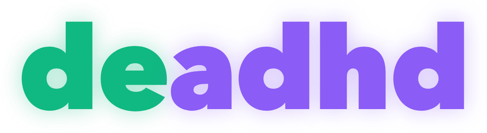
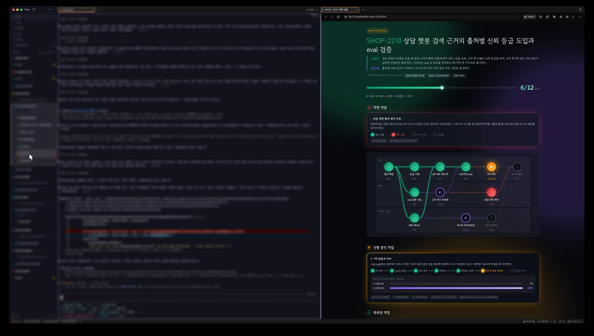
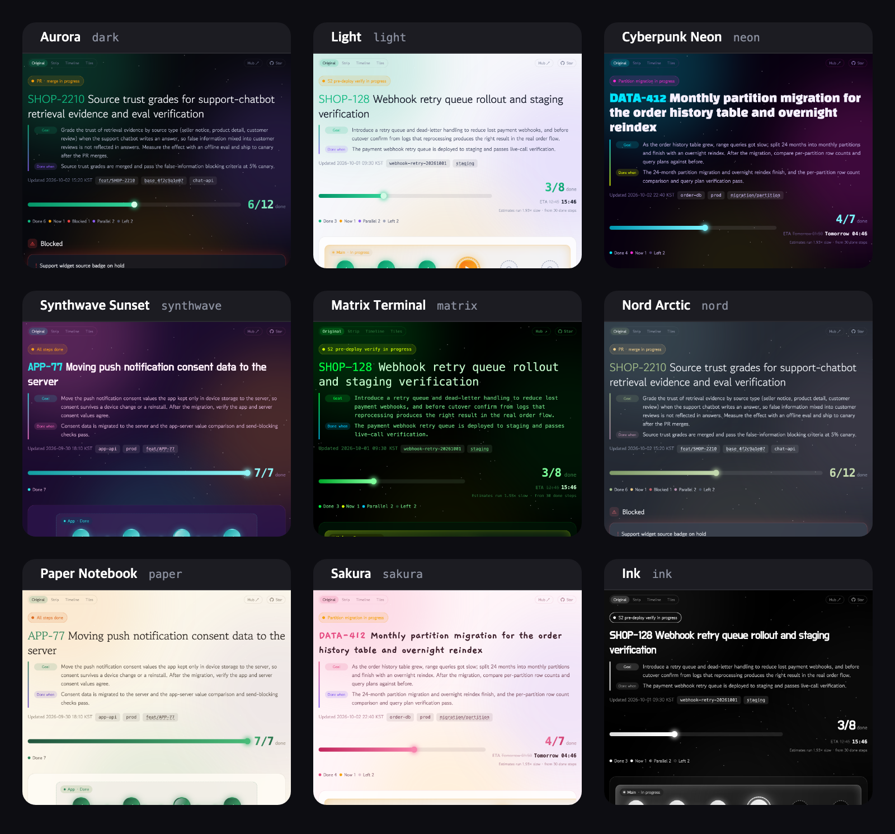
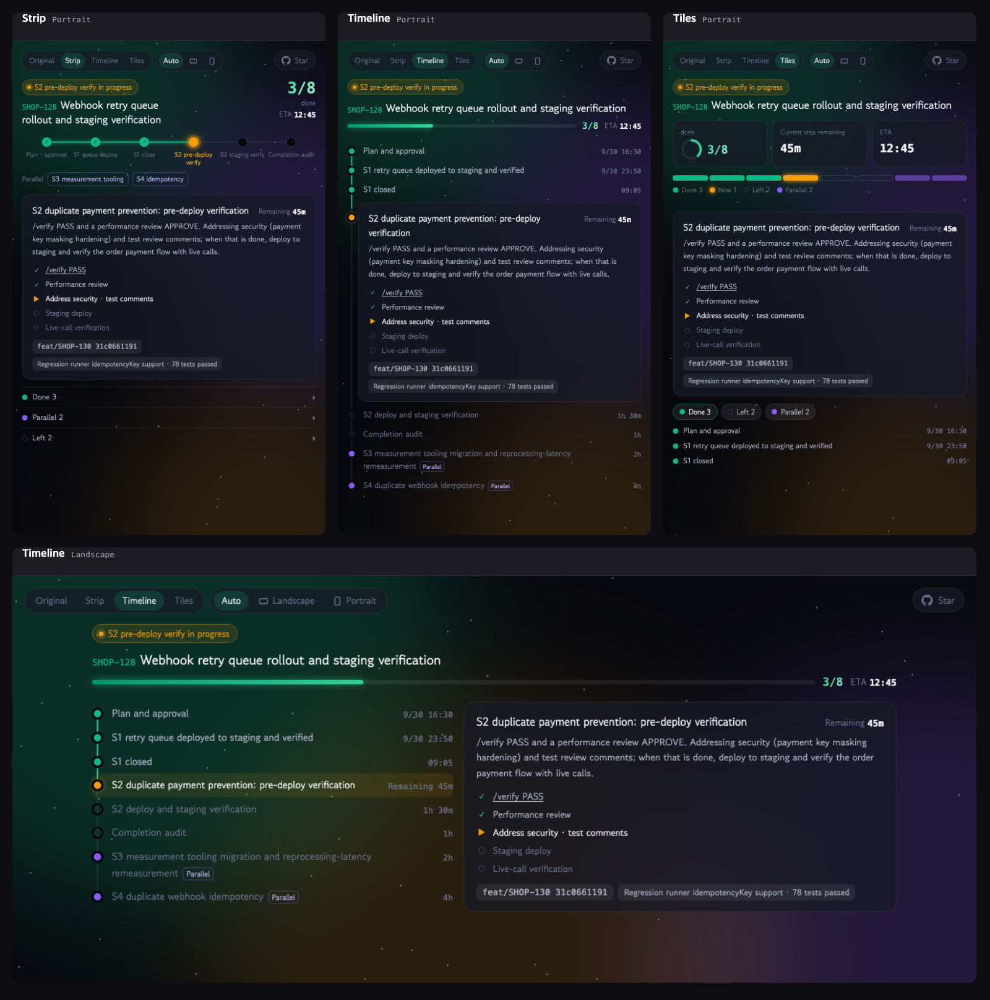

<h1 align="center"></h1>

<p align="center"><a href="README.md">한국어</a> · <b>English</b></p>

<p align="center"><b>dead + ADHD</b><br>A Claude Code progress skill for beating ADHD</p>

<p align="center"><i>A Claude Code skill that shows a live checklist page of what each session has done, is doing now, and has left.</i></p>

When you run several Claude Code sessions at once, it is easy to lose track of how far a session got while you were looking at another one. deadhd opens the session's progress as a checklist page, so you can see it at a glance without scrolling back through the terminal log.



## Use cases

Built for using Claude Code in a terminal app with an in-app browser, such as [Orca](https://onorca.dev), and keeping the progress page open in a panel beside the terminal. Typing `/deadhd` in the working session opens a page that lays out completed, in-progress, and remaining steps as a flow diagram and cards, and the page keeps updating while the work runs. When you leave a long task running and come back, you can check progress from one page instead of scrolling back through the terminal log.

Inside Orca it opens by default (`auto`) in a tab beside the terminal. Outside Orca you can open it in the system browser or the Claude desktop app's in-app browser. Choose the open location in [Settings](#settings).

## Themes

This is the same set of cases rendered in each theme. You can see a multi-lane flow, blocked work, a completion estimate that crosses midnight, and a state where every step is done. Pick a default theme with `/deadhd setup`, or change it for one run with `/deadhd --theme <theme>`.



## View modes

The buttons at the top left of the page switch the same progress between four views. Where the page is narrow, such as the Claude artifact panel or a split Orca tab, the compact views are easier to read at a glance.

| View | Layout |
|---|---|
| Original | The default page with the flow diagram and a card for every step |
| Strip | Shrinks the step flow to one row of dots and expands only the card for the step in progress. The other steps are folded into done, parallel, and left groups |
| Timeline | Stacks the steps one per row, each with its finish time or estimate. The step in progress is shown as a card |
| Tiles | Leads with numbers (steps done, time left on the current step, expected completion) and shows each step's state as a segmented bar |

Picking a compact view shows the `Auto`, `Landscape`, and `Portrait` buttons. `Auto` uses the landscape layout when the tab is wider than 5:4 and at least 760px wide, and the portrait layout otherwise, and it re-lays out as soon as you resize the tab. The chosen view and layout survive the 15-second auto-refresh and work in every theme and in the English UI.

The browser draws a view from the data already in the page when you press its button. The model still writes the same data, so the views add no token cost.



## How it works

- The done mark is attached only to steps confirmed by the session's own run results. Only steps with a result — a passing test, a written file, a merged PR — are classified as `done`; steps that were attempted but not verified are shown as `now` or `blocked`.
- Each step shows its supporting evidence: file paths, PRs, commits, test pass counts.
- The page design is fixed in `template.html`, and the model writes only the JSON data. `render.py` validates the data and generates the HTML.
- When per-step start and finish times and remaining-time estimates are present, the expected completion time appears under the progress bar. The `tomorrow` or date notation is decided from the time you are viewing the page, so it changes on its own after midnight or when you reopen the window.
- An open tab reloads every 15 seconds, and newly completed steps play a completion effect.
- When the user talks in English, the page's fixed labels (`done`, `In progress`, `Remaining`, and so on) are shown in English too. This is set by the data's `lang` field; without it the page is Korean.

## Requirements

- [Claude Code](https://code.claude.com)
- `python3` (standard library only)

## Install

### Install as a plugin

Run these commands in Claude Code.

```
/plugin marketplace add lcalmsky/deadhd
/plugin install deadhd@deadhd
```

Installed as a plugin, the invocation name is `/deadhd:deadhd`.

<a id="orca-install"></a>

### Install from Orca

If you use [Orca](https://onorca.dev), open the [share link](https://share.onorca.dev/skills/share/shr_56a6f814e1b1b8aae3d9ee02f13c48e411b22008ead93ec1) and press `Open in Orca`. Orca lets you review the included files and choose where to install. After installing, the invocation name is `/deadhd`.

> An Orca share link is a frozen bundle of the files uploaded at publish time. The current link contains v1.6.0, and releases after that are not reflected. For the latest version, install via the plugin or the skill folder.

### Install as a skill folder

```bash
git clone https://github.com/lcalmsky/deadhd.git
cp -r deadhd/skills/deadhd ~/.claude/skills/
```

Installed this way, the invocation name is `/deadhd`.

## Update

| Install method | How to update |
|---|---|
| Plugin | Auto-update is off by default for third-party marketplaces. In `/plugin`, select deadhd and press **Update now**, or run `claude plugin update deadhd@deadhd`. Turning on **Enable auto-update** for the deadhd marketplace in the Marketplaces tab of `/plugin` installs new versions automatically. After updating, run `/reload-plugins` or start a new session |
| Orca | A share link is a fixed copy from publish time, so reopening it does not install a new version. For the latest version, install via the plugin or the skill folder |
| Skill folder | `git pull` in the cloned repository, then copy `skills/deadhd` again |

## Usage

| Input | Behavior |
|---|---|
| `/deadhd` | Opens the progress page in a browser tab (same as `-h`) |
| `/deadhd -o` | Publishes as an Orca artifact (a web page with a shareable link). Requires an orca CLI login; falls back to a browser tab on failure |
| `/deadhd -c` | Publishes as a Claude artifact |
| `/deadhd setup` | Chooses the default open location again |
| `/deadhd --open <mode>` | Opens in a different location for this run only |
| `/deadhd --theme <theme>` | Renders with a different theme for this run only |
| `/deadhd off` | Stops updating the page |

Instead of a command, you can ask in plain words, e.g. "show progress" or "show me a checklist".

## Settings

On the first run, it asks once for the open location and the theme. The chosen values are reused from the next run on.

| Value | Behavior |
|---|---|
| `auto` | Opens an Orca tab when running inside Orca, otherwise the system browser |
| `orca` | Opens an Orca tab when the `orca` command is available |
| `browser` | Skips Orca and opens the system browser |
| `desktop` | Does not open the page; prints only the path. Press that path in the Claude desktop app to open it in the in-app browser panel |

The theme uses these values.

| Value | Behavior |
|---|---|
| `system` | Follows the operating system's light/dark setting (recommended) |
| `light` | Always the light theme |
| `dark` | Always the dark theme (Aurora) |
| `neon` | Cyberpunk neon: near-black violet with cyan, magenta, and fluorescent yellow |
| `synthwave` | Synthwave sunset: deep violet over a pink-and-orange retro sunset |
| `matrix` | Matrix terminal: green monochrome on black, every glyph monospaced |
| `nord` | Nord arctic: a calm palette that is easy on the eyes over a long session |
| `paper` | Paper notebook: a warm paper-texture light theme with a serif heading |
| `sakura` | Sakura: a cherry-blossom pink light theme with a handwritten heading |

The config file is `~/.config/deadhd/config.json`, created under `XDG_CONFIG_HOME` when that is set. `/deadhd setup` lets you choose the open location and theme again at any time.

If `~/.config/deadhd/writing-rules.md` exists, page sentences follow that file's rules. Without it, the default rules apply (noun-phrase titles, field terminology, no personification). You can symlink it to your own writing guide.

Call it once after starting a long task, and Claude updates the data whenever a step's state changes. A complete example of the data format is in [`skills/deadhd/example.json`](skills/deadhd/example.json).

## Test

```bash
cd skills/deadhd
python3 -m pytest -q test_render.py
```

The theme gallery (`docs/themes.png`) can be regenerated on a machine with Chrome via `python3 docs/capture_themes.py`. The English gallery (`docs/themes.en.png`) is `python3 docs/capture_themes.py --lang en`. The view mode images (`docs/views.png`, `docs/views.en.png`) are regenerated with `python3 docs/capture_views.py` and `python3 docs/capture_views.py --lang en`.

## License

[MIT](LICENSE)
