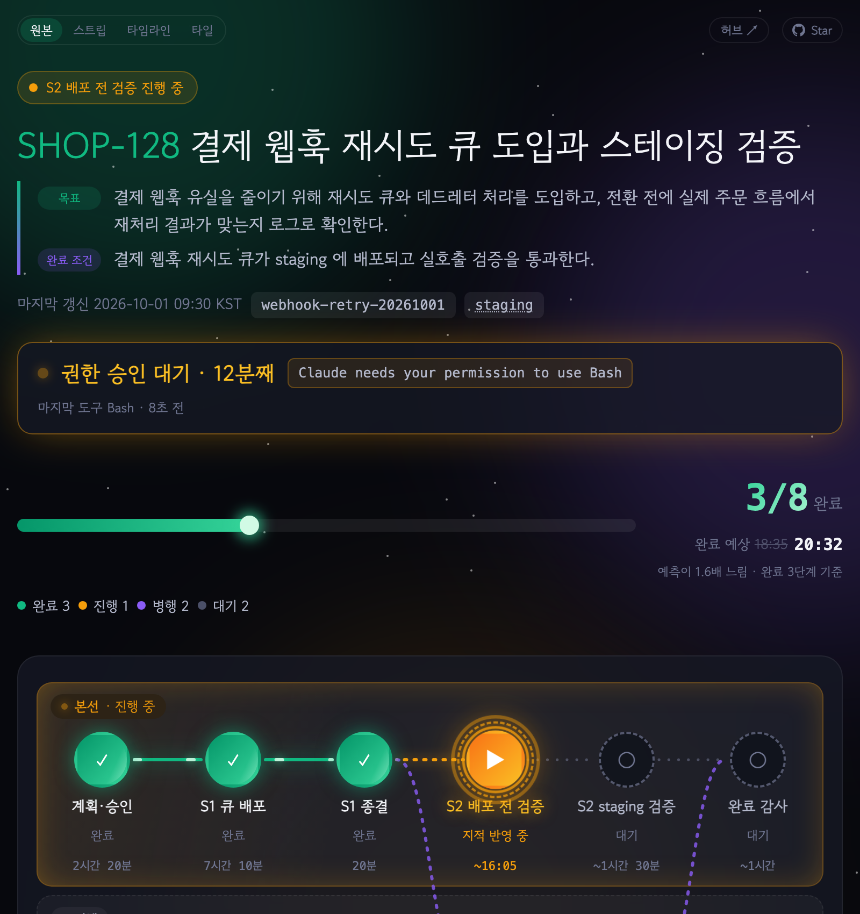
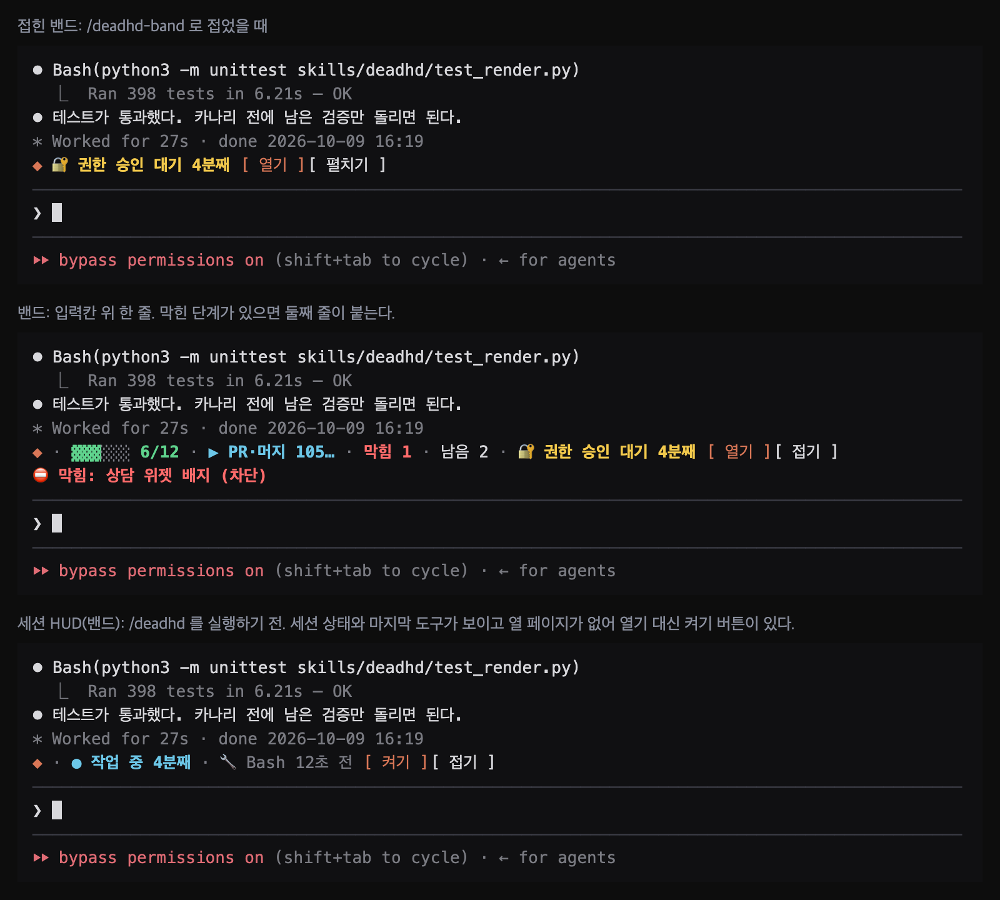
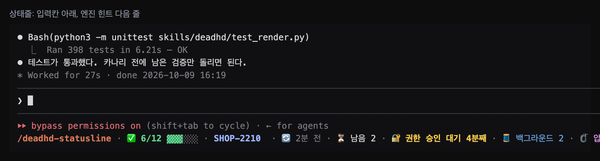
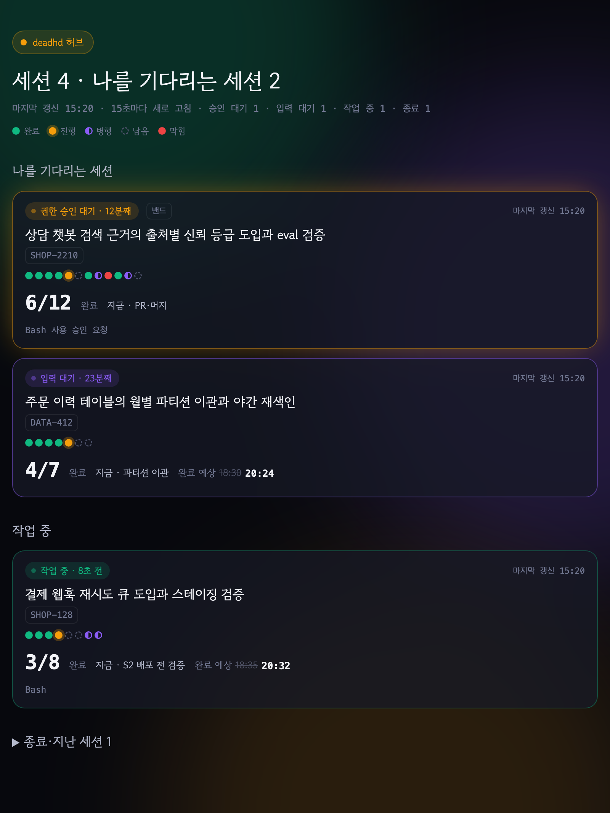
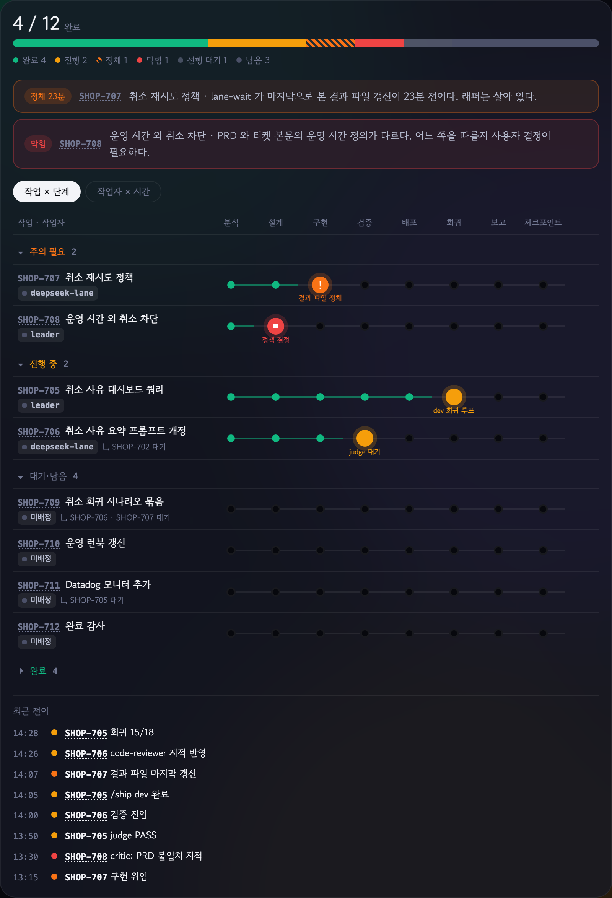

<h1 align="center"></h1>

<p align="center"><b>한국어</b> · <a href="README.en.md">English</a></p>

<p align="center"><b>dead + ADHD</b>: ADHD를 무찌르기 위한 Claude Code 진행 상황 스킬</p>

<p align="center">
  <a href="https://github.com/lcalmsky/deadhd/releases/latest"></a>
  <a href="LICENSE"></a>
  
  
</p>

<p align="center">
  <a href="#빠른-시작">빠른 시작</a> ·
  <a href="#기능">기능</a> ·
  <a href="#설치">설치</a> ·
  <a href="#사용법">사용법</a> ·
  <a href="#설정">설정</a> ·
  <a href="#동작-방식">동작 방식</a>
</p>

Claude Code 세션을 여러 개 띄워 놓고 일하다 보면, 다른 세션을 보고 돌아왔을 때 이 세션이 어디까지 진행했는지 놓치기 쉽습니다. deadhd 는 세션이 완료한 단계, 진행 중인 단계, 남은 단계를 체크리스트 페이지로 띄워 두고 작업이 진행되는 동안 계속 갱신합니다. 터미널 로그를 거슬러 올라가지 않아도 페이지 한 장으로 진행 상황을 확인할 수 있습니다.

<p align="center"></p>

[Orca](https://onorca.dev) 처럼 인앱 브라우저를 갖춘 터미널 앱에서 진행 페이지를 터미널 옆 패널에 띄워 두는 용도로 만들었습니다. Orca 를 쓰지 않으면 시스템 브라우저나 Claude 데스크톱 앱의 인앱 브라우저로 열고, Claude Code 에서는 페이지 대신 프롬프트 위아래의 한 줄로도 볼 수 있습니다.

## 빠른 시작

Claude Code 에서 플러그인을 설치합니다.

```
/plugin marketplace add lcalmsky/deadhd
/plugin install deadhd@deadhd
```

긴 작업을 시작한 세션에서 `/deadhd:deadhd` 를 입력합니다. 처음 실행할 때 열기 위치, 표시 방식, 테마, 글꼴을 한 번 묻고, 그 뒤로는 단계의 상태가 바뀔 때마다 Claude 가 페이지를 갱신합니다. 명령 대신 "진행 상황 띄워줘", "체크리스트로 보여줘" 처럼 요청해도 됩니다.

다른 설치 방법은 [설치](#설치)에 있습니다.

## 기능

| 기능 | 내용 |
|---|---|
| [진행 페이지](#진행-페이지와-상태-띠) | 완료·진행·남은 단계를 흐름도와 카드로 보여 주고, 단계마다 근거가 되는 파일·PR·커밋·테스트 통과 건수를 붙입니다 |
| [상태 띠](#진행-페이지와-상태-띠) | 권한 승인 대기, 입력 대기, 마지막 도구, 압축 같은 세션 상태를 페이지 위쪽에 알려 줍니다 |
| [보정 완료 예상](#입력-대기-알림과-예상-시간-보정) | 처음 적은 예상과 실제 소요의 이력을 쌓아, 3건부터 보정한 완료 예상 시각을 함께 보여 줍니다 |
| [표시 방식 3종](#표시-방식) | 브라우저 페이지, 프롬프트 위 밴드, 프롬프트 아래 상태줄 중에서 고릅니다 |
| [보기 모드 4종](#보기-모드) | 같은 진행 상황을 원본·스트립·타임라인·타일로 바꿔 봅니다 |
| [허브](#허브) | 이 컴퓨터에서 도는 세션을 한 장에 모아 상태 순으로 정렬합니다 |
| [레인 보드](#레인-보드) | 병렬로 도는 작업 단위를 작업 × 단계 표로 보여 줍니다 |
| [테마 10종과 글꼴 12종](#테마와-글꼴) | 페이지 테마와 제목 글꼴을 고릅니다 |

### 진행 페이지와 상태 띠

작업 중인 세션에서 `/deadhd` 를 입력하면 완료한 단계, 진행 중인 단계, 남은 단계를 흐름도와 카드로 정리한 페이지가 열립니다. 작업이 길어지면 페이지 위쪽에 이 세션이 지금 무엇을 기다리는지 알려 주는 상태 띠가 붙고, 이 띠는 모델이 아니라 플러그인 훅이 유지합니다.

<p align="center"></p>

### 표시 방식

같은 진행 상황을 세 가지 방식으로 볼 수 있습니다. 밴드와 상태줄은 페이지를 열지 않고 Claude Code 터미널 안에서 바로 보는 방식입니다.

| 표시 방식 | 위치 | 구성 |
|---|---|---|
| `band` | 프롬프트 위 한 줄 | 세션 상태와 마지막 도구를 먼저 보여 주고, 체크리스트가 있으면 완료 수와 진행 막대, 지금 하는 단계와 경과 시간, 막힘·남음이 붙습니다. 브라우저 탭을 열지 않아 가장 가볍습니다 |
| `statusline` | 프롬프트 아래 한 줄 | 세션 상태와 마지막 도구에 티켓 키와 제목, 진행 중인 단계의 PR, 다음 단계, 완료 예상, 마지막 갱신, 백그라운드 작업·압축 횟수까지 담습니다 |
| `html` | 브라우저 페이지 | 위의 진행 페이지입니다 |

체크리스트의 상태 파일은 `/deadhd` 를 실행해야 생깁니다. 그 전에도 mod 는 세션의 이벤트를 직접 보며 **세션 상태**(`● 작업 중 N분째`, `⌨️ 입력 대기 N분째`)와 **마지막 도구**(`🔧 도구이름 N초 전`)를 그립니다. 상태줄은 여기에 지켜본 **압축 횟수**(`🗜 압축 N`)까지 더합니다. 세션이 시작하자마자 대화에 아무것도 남기지 않고 상태가 보이는 것은 이 때문입니다. 아직 열 페이지가 없으니 이때는 `열기` 버튼이 없고, `/deadhd` 를 실행하면 위 체크리스트 필드가 같은 줄에 붙습니다.

**밴드**는 막힌 단계가 있으면 둘째 줄이 붙습니다. `/deadhd-band` 로 접으면 세션 상태와 `열기`·`펼치기` 버튼만 남습니다.

<p align="center"></p>

**상태줄**은 같은 상태 파일을 더 많은 항목으로 담습니다. 티켓 키와 진행 중인 단계의 PR 은 누르면 열리는 링크입니다. 터미널 폭을 넘으면 제목부터 잘려 `…` 이 붙고, 그래도 넘치면 덜 중요한 항목부터 빠지며 세션 상태와 완료 수는 끝까지 남습니다. 줄 끝의 `열기` 버튼으로 페이지를 엽니다. `/deadhd-statusline` 으로 접으면 세션 상태 한 조각만 남습니다.

<p align="center"></p>

`/deadhd setup` 에서 고르거나 `/deadhd --view <값>` 으로 바꿉니다. 우선순위는 `--view` 값, 이 세션의 상태 파일에 기록된 값, 설정값, 기본값 `html` 순입니다. 그래서 `--view band` 로 한 번 실행하면 그 세션은 이후 렌더에서도 밴드로 그립니다.

밴드와 상태줄은 deadhd 플러그인의 mod(`skills/deadhd/hooks/register.tsx`)가 그리며 **Claude Code 전용**입니다. mod 는 세션의 이벤트(턴 시작·끝, 도구 호출, 압축)로 세션 상태를 직접 관측하고 스킬이 쓴 상태 파일을 읽습니다. Claude Code 가 아닌 환경(Codex `$deadhd` 등)에서는 묻지 않고 `html` 로 동작합니다.

<details>
<summary>밴드·상태줄에서 페이지 파일을 다루는 방식</summary>

`band`·`statusline` 에서는 페이지 파일을 곧바로 쓰지 않습니다. 상태 요약과 허브는 매 갱신마다 다시 쓰고, 페이지는 처음 열 때(`/deadhd-open`, `열기` 버튼) 만들고 그 뒤로는 계속 씁니다. 허브에서 아직 페이지가 없는 세션은 링크 대신 표시 방식 이름(`밴드`/`상태줄`)이나 `페이지 없음` 을 보여 줍니다. 현재 표시 방식과 맞지 않는 명령을 부르면 어떻게 바꾸는지 한 줄로 알려 줍니다.

</details>

### 보기 모드

페이지 왼쪽 위 버튼으로 같은 진행 상황을 네 가지 보기로 바꿔 볼 수 있습니다. Claude 아티팩트 패널이나 좁게 나눈 Orca 탭처럼 폭이 좁은 곳에서는 컴팩트 보기가 한눈에 읽기 쉽습니다.

| 보기 | 구성 |
|---|---|
| 원본 | 흐름도와 단계별 카드를 모두 보여 주는 기본 페이지입니다 |
| 스트립 | 단계 흐름을 한 줄의 점으로 줄이고, 진행 중인 단계 카드만 펼칩니다. 나머지 단계는 완료·병행·남음으로 접어 둡니다 |
| 타임라인 | 단계를 한 줄씩 세로로 쌓고, 단계마다 완료 시각이나 예상 시간을 붙입니다. 진행 중인 단계는 카드로 보여 줍니다 |
| 타일 | 완료 수, 현재 단계의 남은 시간, 완료 예상 시각을 숫자로 먼저 보여 주고, 단계별 상태를 구간 막대로 보여 줍니다 |

<p align="center"></p>

컴팩트 보기를 고르면 `자동`·`가로`·`세로` 버튼이 나타납니다. `자동`은 탭이 5:4보다 넓고 폭이 760px 이상이면 가로 배치로, 그렇지 않으면 세로 배치로 그리며, 탭 크기를 바꾸면 바로 다시 배치합니다. 고른 보기와 배치는 15초 자동 새로 고침 뒤에도 유지됩니다. 보기는 페이지에 이미 들어 있는 데이터로 브라우저가 그리므로, 보기를 바꿔도 토큰 사용량은 늘지 않습니다.

### 허브

이 컴퓨터에서 도는 세션을 한 장에 모은 페이지입니다. `/deadhd hub` 로 열거나 세션 페이지 오른쪽 위의 `허브 ↗` 버튼으로 이동합니다. 타일에는 상태 배지, 제목과 키, 단계별 미니 스트립, `6/12 완료`, 지금 하는 일, 완료 예상이 나옵니다.

<p align="center"></p>

- 승인 대기 > 신호 없음 > 입력 대기 > 작업 중 > 훅 없음 > 완료 > 종료 > 지난 세션 순으로 정렬하고, 같은 상태에서는 오래 기다린 세션이 위로 옵니다.
- 타일을 누르면 같은 탭에서 그 세션의 페이지로 이동하고, 세션 페이지의 `허브 ↗` 버튼도 같은 탭에서 허브로 돌아옵니다.
- 상태 파일을 쓰는 1.8.0 이후 세션만 모입니다. 24시간 넘게 갱신이 없는 세션은 「종료·지난 세션」으로 접힙니다.

### 레인 보드

에픽의 하위 작업처럼 작업 단위가 넷 이상 병렬로 돌면, 데이터의 `board` 에 레인을 채워 페이지 아래에 작업 × 단계 표를 붙입니다. 레인마다 진행 단계, 작업자, 마지막 신호, 남은 시간, 티켓 전이 기록이 한 줄로 나오고, 완료·진행·정체·막힘·선행 대기·남음이 몇 건인지 위에 요약합니다.

<p align="center"></p>

정체 판정은 마지막 신호 뒤 얼마나 조용했는지(`stallAfter`, 기본 10분)를 브라우저가 직접 재므로, 모델이 갱신을 멈춘 레인도 정체로 드러나 주의 띠에 올라옵니다. 작업자를 나눠 돌리는 하네스 세션과 기본 서브에이전트에 일을 넘기는 보통 세션이 같은 형식을 씁니다. `board` 가 없는 세션은 흐름도만 그립니다.

### 테마와 글꼴

테마 9종을 3×3 갤러리로 묶은 화면입니다. 레인이 여러 개인 흐름, 막힌 작업, 자정을 넘기는 완료 예상, 모든 단계를 마친 상태를 함께 볼 수 있습니다. `system` 은 운영체제 설정을 따르므로 갤러리에서 빠집니다.

<p align="center"></p>

`/deadhd setup` 에서 기본값을 고르거나, `/deadhd --theme <테마>`·`/deadhd --font <프리셋>` 으로 이번 실행만 바꿉니다.

<details>
<summary>테마 10종</summary>

| 값 | 설명 |
|---|---|
| `system` | 운영체제의 라이트/다크 설정을 따릅니다 (권장) |
| `light` | 항상 라이트 테마로 표시합니다 |
| `dark` | 항상 다크 테마(오로라)로 표시합니다 |
| `neon` | 사이버펑크 네온: 검보라 배경에 시안·마젠타·형광 노랑 |
| `synthwave` | 신스웨이브 선셋: 진보라 위 핑크·오렌지 레트로 노을 |
| `matrix` | 매트릭스 터미널: 검정 위 초록 단색, 모든 글자 고정폭 |
| `nord` | 노르드 아크틱: 오래 띄워 둬도 눈이 덜 피곤한 차분한 톤 |
| `paper` | 페이퍼 노트북: 따뜻한 종이 질감의 라이트 테마, 명조 제목 |
| `sakura` | 사쿠라: 벚꽃 분홍 라이트 테마, 손글씨 제목 |
| `ink` | 잉크: 순흑 위 순백의 흑백 테마. 상태를 색 대신 채움·테두리·빗금으로 구분합니다 |

</details>

<details>
<summary>제목 글꼴 프리셋 12종</summary>

프리셋에는 글꼴·굵기·자간이 묶여 있고, 기본값 `default` 는 테마가 정한 제목 글꼴을 그대로 씁니다. 본문 글꼴은 바뀌지 않습니다.

| 값 | 글꼴 | 굵기 · 자간 |
|---|---|---|
| `default` | 테마가 정한 글꼴 | 테마에 따름 |
| `pretendard` | Pretendard Variable | 800 · -0.03em |
| `noto-sans` | Noto Sans KR | 900 · -0.03em |
| `plex-sans` | IBM Plex Sans KR | 700 · -0.02em |
| `gothic-a1` | Gothic A1 | 900 · -0.03em |
| `nanum-gothic` | Nanum Gothic | 800 · -0.02em |
| `noto-serif` | Noto Serif KR | 900 · -0.02em |
| `nanum-myeongjo` | Nanum Myeongjo | 800 · -0.02em |
| `hahmlet` | Hahmlet | 900 · -0.02em |
| `gowun-batang` | Gowun Batang | 700 · -0.01em |
| `do-hyeon` | Do Hyeon | 400 · -0.04em |
| `black-han-sans` | Black Han Sans | 400 · 0 |

</details>

## 설치

필요한 것은 [Claude Code](https://code.claude.com) 와 `python3`(표준 라이브러리만 사용)입니다. 세 가지 방법 중 하나만 씁니다.

| 방법 | 호출 이름 | 상태 띠 훅 |
|---|---|---|
| [플러그인](#플러그인으로-설치) (권장) | `/deadhd:deadhd` | 포함 |
| [스킬 폴더](#스킬-폴더로-설치) | `/deadhd` | [직접 등록](#훅-직접-등록) |
| [Orca 공유 링크](#orca-install) | `/deadhd` | [직접 등록](#훅-직접-등록) |

### 플러그인으로 설치

```
/plugin marketplace add lcalmsky/deadhd
/plugin install deadhd@deadhd
```

### 스킬 폴더로 설치

```bash
git clone https://github.com/lcalmsky/deadhd.git
cp -r deadhd/skills/deadhd ~/.claude/skills/
```

`skills/deadhd/.claude-plugin/` 이 함께 복사되므로, 이 폴더는 다음 세션부터 `deadhd@skills-dir` 플러그인으로 자동으로 읽혀 밴드·상태줄이 붙습니다. 상태 띠를 만드는 명령 훅은 따라오지 않습니다.

> [!WARNING]
> 플러그인 설치와 스킬 폴더 설치를 함께 쓰지 마세요. 함께 두면 `deadhd` 플러그인이 두 번 로드되어 같은 명령과 같은 상태 키, 같은 상태 파일을 보는 타이머가 둘이 됩니다.

<a id="orca-install"></a>

### Orca 에서 설치

[Orca](https://onorca.dev) 를 사용한다면 [공유 링크](https://share.onorca.dev/skills/share/shr_fff4656cd0eb2b802d3826cd234e8637705e641a15c81eec) 를 열고 `Open in Orca` 를 누릅니다. Orca 에서 포함된 파일을 확인한 뒤 설치 위치를 고를 수 있습니다.

> [!NOTE]
> Orca 공유 링크는 게시할 때 올린 파일을 바꿀 수 없는 묶음으로 보관합니다. 지금 링크에는 v1.12.0 이 들어 있고, 그 뒤의 릴리즈는 반영되지 않습니다. 최신 버전은 플러그인이나 스킬 폴더 방식으로 설치합니다.

### 업데이트

| 설치 방식 | 업데이트 방법 |
|---|---|
| 플러그인 | 서드파티 마켓플레이스는 자동 업데이트가 기본으로 꺼져 있습니다. `/plugin` 에서 deadhd 를 골라 **Update now** 를 누르거나 `claude plugin update deadhd@deadhd` 를 실행합니다. `/plugin` 의 Marketplaces 탭에서 **Enable auto-update** 를 켜 두면 새 버전이 자동으로 설치됩니다. 업데이트 뒤에는 `/reload-plugins` 를 실행하거나 새 세션을 시작합니다 |
| 스킬 폴더 | 클론한 저장소에서 `git pull` 한 뒤 `skills/deadhd` 를 다시 복사합니다 |
| Orca | 공유 링크는 게시 시점의 고정 사본이라 다시 열어도 새 버전이 설치되지 않습니다 |

## 사용법

| 입력 | 동작 |
|---|---|
| `/deadhd` | 진행 상황 페이지를 브라우저 탭으로 엽니다 (`-h` 와 같음) |
| `/deadhd -o` | Orca 아티팩트(공유 링크가 있는 웹 페이지)로 게시합니다. orca CLI 로그인이 필요하고, 실패하면 브라우저 탭으로 엽니다 |
| `/deadhd -c` | Claude 아티팩트로 게시합니다 |
| `/deadhd setup` | 기본 열기 위치·표시 방식·테마·글꼴을 다시 고릅니다 |
| `/deadhd hub` | 이 컴퓨터의 세션을 모은 허브 페이지를 엽니다 |
| `/deadhd --open <모드>` | 이번 실행만 다른 위치로 엽니다 |
| `/deadhd --view <표시 방식>` | 이번 실행만 다른 표시 방식으로 그립니다 |
| `/deadhd --theme <테마>` | 이번 실행만 다른 테마로 렌더합니다 |
| `/deadhd --font <프리셋>` | 이번 실행만 다른 제목 글꼴로 렌더합니다 |
| `/deadhd off` | 페이지 갱신을 중지합니다 |

Claude Code 에서 밴드나 상태줄로 보고 있으면 다음 명령도 씁니다.

| 입력 | 동작 |
|---|---|
| `/deadhd-band` | 프롬프트 위 밴드를 접거나 펼칩니다 |
| `/deadhd-statusline` | 프롬프트 아래 상태줄을 접거나 펼칩니다 |
| `/deadhd-open` | 진행 페이지를 만들어 브라우저로 엽니다 |

## 설정

처음 실행할 때 열기 위치, 표시 방식, 테마, 글꼴을 한 번 묻고, 고른 값은 다음 실행부터 그대로 쓰입니다. `/deadhd setup` 으로 언제든 다시 고를 수 있습니다. 설정 파일은 `~/.config/deadhd/config.json` 이고 `XDG_CONFIG_HOME` 을 지정하면 그 아래에 만들어집니다.

열기 위치는 다음 값을 씁니다.

| 값 | 동작 |
|---|---|
| `auto` | Orca 안에서 실행 중이면 Orca 탭으로, 아니면 시스템 브라우저로 엽니다 |
| `orca` | `orca` 명령이 있으면 Orca 탭으로 엽니다 |
| `browser` | Orca 를 건너뛰고 시스템 브라우저로 엽니다 |
| `desktop` | 페이지를 열지 않고 경로만 출력합니다. Claude 데스크톱 앱에서 그 경로나 출력된 http 주소를 누르면 인앱 브라우저 패널로 열립니다 |

표시 방식은 `band`(권장), `statusline`, `html` 중에서 고릅니다([표시 방식](#표시-방식)). 테마와 글꼴 값은 [테마와 글꼴](#테마와-글꼴)에 있습니다.

`~/.config/deadhd/writing-rules.md` 를 두면 페이지 문장을 쓸 때 그 파일의 작성 규칙을 따릅니다. 없으면 기본 규칙(제목은 명사구, 분야 용어 사용, 의인화 금지)을 씁니다. 자기 작성 가이드 파일에 심볼릭 링크로 연결해도 됩니다.

## 동작 방식

- **완료 표시는 실행 결과로 확인된 단계에만 붙습니다.** 테스트 통과, 파일 작성, PR 머지처럼 결과가 남은 단계만 `done` 으로 분류하고, 시도했지만 검증하지 못한 단계는 `now` 또는 `blocked` 로 표시합니다. 단계마다 근거가 되는 파일 경로, PR, 커밋, 테스트 통과 건수가 함께 표시됩니다.
- **모델은 JSON 데이터만 작성합니다.** 페이지 디자인은 `template.html` 에 고정되어 있고, `render.py` 가 데이터를 검증한 뒤 HTML 을 생성합니다. 테마와 글꼴 CSS 는 `themes.css` 로 분리되어 세션 페이지와 허브가 같은 파일을 씁니다. 데이터 형식의 전체 예시는 [`skills/deadhd/example.json`](skills/deadhd/example.json) 에 있습니다.
- **영어로 대화하면 페이지의 고정 문구도 영어로 표시됩니다.** 데이터의 `lang` 필드로 정해지며, 없으면 한국어입니다.
- **완료 예상 시각은 데이터 파일이 마지막으로 수정된 시각을 기준으로 계산합니다.** 그래서 훅이 데이터를 바꾸지 않고 페이지를 다시 렌더해도 예상 시각이 밀리지 않습니다. 이미 지난 예상에는 ` (지남)` 이 붙고, `내일` 이나 날짜 표기는 페이지를 보는 시점을 기준으로 정해지므로 자정이 지나면 자동으로 바뀝니다.
- **열어 둔 탭은 15초마다 새로 고쳐집니다.** 새로 완료된 단계에는 완료 효과가 재생되고, 상태 띠도 같은 주기로 갱신됩니다.
- **페이지는 127.0.0.1 전용 정적 서버(`serve.py`)로 열립니다.** Orca 같은 인앱 브라우저가 페이지 안의 `file://` 이동을 막기 때문입니다. 서버는 처음 페이지를 열 때 자동으로 뜨고 세션이 끝나도 남습니다. `/tmp` 의 `deadhd-*.html` 만 제공하고, 심볼릭 링크는 따르지 않으며, 외부 사이트가 읽지 못하도록 `Host` 헤더를 검사합니다. 끄려면 `python3 ~/.claude/skills/deadhd/serve.py --stop`(플러그인으로 설치했다면 플러그인 캐시 안의 같은 경로)을 실행합니다.
- **허브는 이 컴퓨터의 세션 상태 파일만 읽어 만듭니다.** `render.py` 가 세션 페이지를 렌더할 때와 훅 이벤트마다 허브 파일을 다시 씁니다.

### 입력 대기 알림과 예상 시간 보정

플러그인으로 설치하면 `hooks/hooks.json` 의 훅이 세션 이벤트(권한 요청, 답변 종료, 도구 실행, 압축, 세션 종료)를 받아 `/tmp/deadhd-state/<세션 ID>.json` 에 상태를 쓰고 페이지를 다시 렌더합니다. 페이지 상단에 `권한 승인 대기 · 12분째`, `입력 대기 · 23분째`, `작업 중 · 마지막 도구 Bash 8초 전`, `신호 없음`, `세션 종료` 띠가 붙습니다. 모델이 갱신을 잊어도 띠는 훅이 유지하고, 압축 뒤에는 세션 시작 훅이 데이터 파일 경로를 모델에 다시 알려 줍니다.

단계가 완료될 때 처음 적힌 예상과 실제 소요가 `~/.config/deadhd/history.jsonl` 에 쌓이고, 3건부터 보정 완료 예상이 원래 값 옆에 표시됩니다. 기록되는 것은 단계 id·예상·실제 분 수뿐입니다.

<a id="훅-직접-등록"></a>

<details>
<summary>훅 직접 등록 (스킬 폴더·Orca 설치)</summary>

스킬 폴더나 Orca 로 설치하면 훅이 따라오지 않습니다. 쓰려면 `~/.claude/settings.json` 에 다음 훅을 넣습니다. 훅이 없으면 페이지에 상태 띠가 붙지 않고, 허브에서는 그 세션이 `훅 없음` 또는 `완료` 로 나옵니다.

```json
{
  "hooks": {
    "Notification": [{ "matcher": "permission_prompt|idle_prompt", "hooks": [{ "type": "command", "command": "python3 \"$HOME/.claude/skills/deadhd/state.py\"" }] }],
    "UserPromptSubmit": [{ "hooks": [{ "type": "command", "command": "python3 \"$HOME/.claude/skills/deadhd/state.py\"" }] }],
    "PostToolUse": [{ "hooks": [{ "type": "command", "command": "python3 \"$HOME/.claude/skills/deadhd/state.py\"" }] }],
    "Stop": [{ "hooks": [{ "type": "command", "command": "python3 \"$HOME/.claude/skills/deadhd/state.py\"" }] }],
    "SessionStart": [{ "matcher": "compact", "hooks": [{ "type": "command", "command": "python3 \"$HOME/.claude/skills/deadhd/state.py\"" }] }],
    "SessionEnd": [{ "hooks": [{ "type": "command", "command": "python3 \"$HOME/.claude/skills/deadhd/state.py\"" }] }]
  }
}
```

</details>

### 파일과 환경 변수

<details>
<summary>deadhd 가 만들고 읽는 파일</summary>

| 경로 | 내용 |
|---|---|
| `/tmp/deadhd-<slug>.json` | 진행 데이터. 모델이 작성합니다 |
| `/tmp/deadhd-<slug>.html` | 진행 페이지 |
| `/tmp/deadhd-hub.html` | 허브 페이지 |
| `/tmp/deadhd-state/<세션 ID>.json` | 세션 상태. 훅과 `render.py` 가 씁니다. 7일이 지난 파일은 정리합니다 |
| `~/.config/deadhd/config.json` | 설정(열기 위치·표시 방식·테마·글꼴) |
| `~/.config/deadhd/history.jsonl` | 예상·실제 이력 |
| `~/.config/deadhd/writing-rules.md` | 작성 규칙(선택) |

</details>

<details>
<summary>환경 변수</summary>

| 변수 | 기본값 |
|---|---|
| `DEADHD_PORT` | `47320` (서버는 127.0.0.1 에서만 받습니다) |
| `DEADHD_HUB` | `/tmp/deadhd-hub.html` |
| `DEADHD_STATE_DIR` | `/tmp/deadhd-state` |
| `DEADHD_HISTORY` | `~/.config/deadhd/history.jsonl` |
| `DEADHD_CONFIG` | `~/.config/deadhd/config.json` |
| `XDG_CONFIG_HOME` | 지정하면 설정과 이력이 `$XDG_CONFIG_HOME/deadhd/` 아래에 만들어집니다 |
| `DEADHD_NOW` | 페이지가 쓰는 시각을 고정합니다. 테스트와 예시 그림 재생성에 씁니다 |

</details>

## 개발

```bash
python3 -m unittest skills/deadhd/test_render.py
```

예시 그림 열네 장은 Chrome 을 설치한 환경에서 다음 명령으로 다시 만듭니다. 모든 그림은 2배율, 폭 1600px 로 찍고 README 에서 `width="800"` 으로 보여 줍니다.

```bash
python3 docs/capture_themes.py && python3 docs/capture_themes.py --lang en   # themes.png, themes.en.png
python3 docs/capture_views.py && python3 docs/capture_views.py --lang en     # views.png, views.en.png
python3 docs/capture_hub.py && python3 docs/capture_hub.py --lang en         # hub.png, hub.en.png, live.png, live.en.png
python3 docs/capture_board.py && python3 docs/capture_board.py --lang en     # board.png, board.en.png
python3 docs/capture_mods.py && python3 docs/capture_mods.py --lang en       # band.png, band.en.png, statusline.png, statusline.en.png
```

## 라이선스

[MIT](LICENSE)
