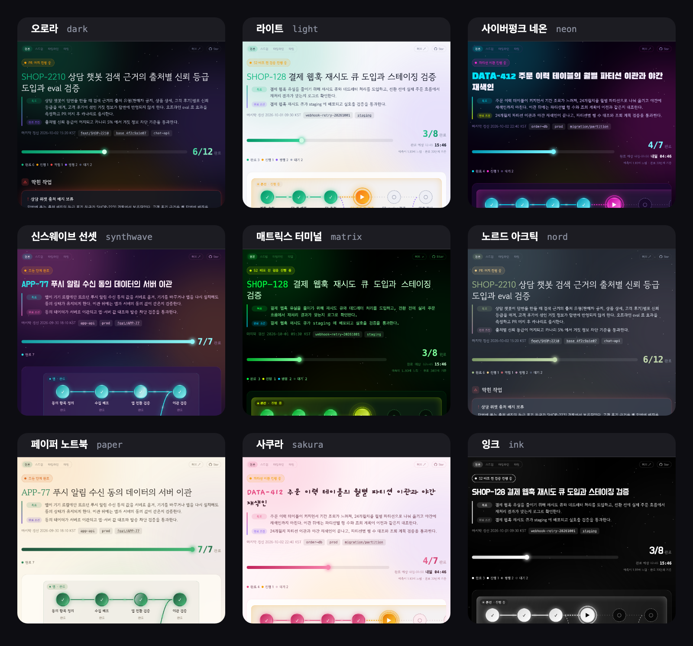
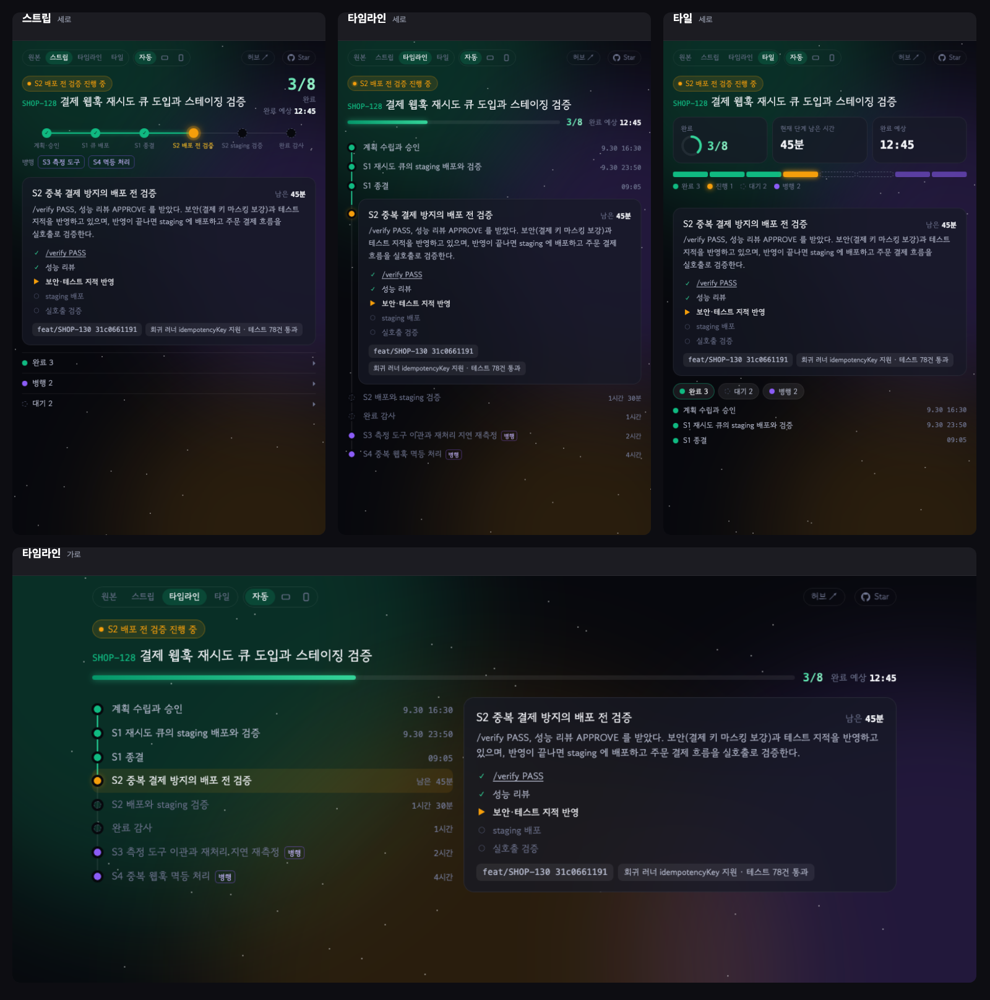

<h1 align="center"></h1>

<p align="center"><b>한국어</b> · <a href="README.en.md">English</a></p>

<p align="center"><b>dead + ADHD</b><br>ADHD를 무찌르기 위한 Claude Code 진행 상황 스킬</p>

<p align="center"><i>A Claude Code skill that shows a live checklist page of what each session has done, is doing now, and has left.</i></p>

Claude Code 세션을 여러 개 띄워 놓고 일하다 보면, 다른 세션을 보고 돌아왔을 때 이 세션이 어디까지 진행했는지 놓치기 쉽습니다. deadhd 는 세션의 진행 상황을 체크리스트 페이지로 띄워 두고, 터미널 로그를 거슬러 올라가지 않아도 한눈에 확인할 수 있게 해 주는 스킬입니다.


## 사용 장면

[Orca](https://onorca.dev) 처럼 인앱 브라우저를 갖춘 터미널 앱에서 Claude Code 를 쓰면서, 진행 상황 페이지를 터미널 옆 패널에 띄워 두는 용도로 만들었습니다. 작업 중인 세션에서 `/deadhd` 를 입력하면 완료한 단계, 진행 중인 단계, 남은 단계를 흐름도와 카드로 정리한 페이지가 열리고, 작업이 진행되는 동안 페이지가 계속 갱신됩니다. 긴 작업을 맡겨 두고 자리를 비웠다가 돌아와도 터미널 로그를 거슬러 올라가지 않고 페이지 한 장으로 진행 상황을 확인할 수 있습니다.

Orca 안에서 실행하면 기본 설정(`auto`)으로 터미널 옆 탭에 바로 열립니다. Orca 를 쓰지 않는 환경에서는 시스템 브라우저나 Claude 데스크톱 앱의 인앱 브라우저로 열 수 있습니다. 열기 위치는 [설정](#설정)에서 고릅니다.

## 테마

테마마다 다른 사례를 렌더한 화면입니다. 레인이 여러 개인 흐름, 막힌 작업, 자정을 넘기는 완료 예상, 모든 단계를 마친 상태를 함께 볼 수 있습니다. `/deadhd setup` 에서 기본 테마를 고르거나, `/deadhd --theme <테마>` 로 이번 실행만 바꿀 수 있습니다.



## 보기 모드

페이지 왼쪽 위 버튼으로 같은 진행 상황을 네 가지 보기로 바꿔 볼 수 있습니다. Claude 아티팩트 패널이나 좁게 나눈 Orca 탭처럼 폭이 좁은 곳에서는 컴팩트 보기가 한눈에 읽기 쉽습니다.

| 보기 | 구성 |
|---|---|
| 원본 | 흐름도와 단계별 카드를 모두 보여 주는 기본 페이지입니다 |
| 스트립 | 단계 흐름을 한 줄의 점으로 줄이고, 진행 중인 단계 카드만 펼칩니다. 나머지 단계는 완료·병행·대기로 접어 둡니다 |
| 타임라인 | 단계를 한 줄씩 세로로 쌓고, 단계마다 완료 시각이나 예상 시간을 붙입니다. 진행 중인 단계는 카드로 보여 줍니다 |
| 타일 | 완료 수, 현재 단계의 남은 시간, 완료 예상 시각을 숫자로 먼저 보여 주고, 단계별 상태를 구간 막대로 보여 줍니다 |

컴팩트 보기를 고르면 `자동`·`가로`·`세로` 버튼이 나타납니다. `자동`은 탭이 5:4보다 넓고 폭이 760px 이상이면 가로 배치로, 그렇지 않으면 세로 배치로 그리며, 탭 크기를 바꾸면 바로 다시 배치합니다. 고른 보기와 배치는 15초 자동 새로 고침 뒤에도 유지되고, 모든 테마와 영어 화면에서 동작합니다.

보기는 버튼을 누를 때 페이지에 이미 들어 있는 데이터로 브라우저가 그립니다. 모델이 쓰는 데이터는 그대로이므로 보기를 추가해도 토큰 사용량은 늘지 않습니다.



## 동작 방식

- 완료 표시는 세션의 실행 결과로 확인된 단계에만 붙습니다. 테스트 통과, 파일 작성, PR 머지처럼 결과가 남은 단계만 `done` 으로 분류하고, 시도했지만 검증하지 못한 단계는 `now` 또는 `blocked` 로 표시합니다.
- 각 단계에는 근거가 되는 파일 경로, PR, 커밋, 테스트 통과 건수가 함께 표시됩니다.
- 페이지 디자인은 `template.html` 에 고정되어 있고, 모델은 JSON 데이터만 작성합니다. `render.py` 가 데이터를 검증한 뒤 HTML 을 생성합니다.
- 사용자가 영어로 대화하면 페이지의 고정 문구(`완료`, `진행 중`, `남은 작업` 같은 라벨)도 영어로 표시됩니다. 데이터의 `lang` 필드로 정해지며, 없으면 한국어입니다.
- 단계별 시작·완료 시각과 남은 시간 추정치가 있으면 진행 바 아래에 완료 예상 시각이 표시됩니다. `내일`이나 날짜로 붙는 표기는 페이지를 보고 있는 시점의 시각을 기준으로 정해지므로, 자정이 지나거나 창을 다시 열면 자동으로 바뀝니다.
- 열어 둔 탭은 15초마다 새로 고쳐지고, 새로 완료된 단계에는 완료 효과가 재생됩니다.

## 요구 사항

- [Claude Code](https://code.claude.com)
- `python3` (표준 라이브러리만 사용)

## 설치

### 플러그인으로 설치

Claude Code 에서 다음 명령을 실행합니다.

```
/plugin marketplace add lcalmsky/deadhd
/plugin install deadhd@deadhd
```

플러그인으로 설치하면 호출 이름은 `/deadhd:deadhd` 입니다.

<a id="orca-install"></a>

### Orca 에서 설치

[Orca](https://onorca.dev) 를 사용한다면 [공유 링크](https://share.onorca.dev/skills/share/shr_3219c0e039e766f8cf266b17d30df3304ddc42aada92d639) 를 열고 `Open in Orca` 를 누릅니다. Orca 에서 포함된 파일을 확인한 뒤 설치 위치를 고를 수 있습니다. 설치하면 호출 이름은 `/deadhd` 입니다.

> Orca 공유 링크는 게시할 때 올린 파일을 바꿀 수 없는 묶음으로 보관합니다. 지금 링크에는 v1.6.1 이 들어 있고, 그 뒤의 릴리즈는 반영되지 않습니다. 최신 버전은 플러그인이나 스킬 폴더 방식으로 설치합니다.

### 스킬 폴더로 설치

```bash
git clone https://github.com/lcalmsky/deadhd.git
cp -r deadhd/skills/deadhd ~/.claude/skills/
```

이 방식으로 설치하면 호출 이름은 `/deadhd` 입니다.

## 업데이트

| 설치 방식 | 업데이트 방법 |
|---|---|
| 플러그인 | 서드파티 마켓플레이스는 자동 업데이트가 기본으로 꺼져 있습니다. `/plugin` 에서 deadhd 를 골라 **Update now** 를 누르거나 `claude plugin update deadhd@deadhd` 를 실행합니다. `/plugin` 의 Marketplaces 탭에서 deadhd 마켓플레이스의 **Enable auto-update** 를 켜 두면 새 버전이 자동으로 설치됩니다. 업데이트 뒤에는 `/reload-plugins` 를 실행하거나 새 세션을 시작합니다 |
| Orca | 공유 링크는 게시 시점의 고정 사본이라 다시 열어도 새 버전이 설치되지 않습니다. 최신 버전은 플러그인이나 스킬 폴더 방식으로 설치합니다 |
| 스킬 폴더 | 클론한 저장소에서 `git pull` 한 뒤 `skills/deadhd` 를 다시 복사합니다 |

## 사용법

| 입력 | 동작 |
|---|---|
| `/deadhd` | 진행 상황 페이지를 브라우저 탭으로 엽니다 (`-h` 와 같음) |
| `/deadhd -o` | Orca 아티팩트(공유 링크가 있는 웹 페이지)로 게시합니다. orca CLI 로그인이 필요하고, 실패하면 브라우저 탭으로 엽니다 |
| `/deadhd -c` | Claude 아티팩트로 게시합니다 |
| `/deadhd setup` | 기본 열기 위치를 다시 고릅니다 |
| `/deadhd --open <모드>` | 이번 실행만 다른 위치로 엽니다 |
| `/deadhd --theme <테마>` | 이번 실행만 다른 테마로 렌더합니다 |
| `/deadhd --font <프리셋>` | 이번 실행만 다른 제목 글꼴로 렌더합니다 |
| `/deadhd off` | 페이지 갱신을 중지합니다 |

명령 대신 "진행 상황 띄워줘", "체크리스트로 보여줘" 처럼 요청해도 됩니다.

## 설정

처음 실행할 때 열기 위치, 테마, 글꼴을 한 번 묻습니다. 고른 값은 다음 실행부터 그대로 쓰입니다.

| 값 | 동작 |
|---|---|
| `auto` | Orca 안에서 실행 중이면 Orca 탭으로, 아니면 시스템 브라우저로 엽니다 |
| `orca` | `orca` 명령이 있으면 Orca 탭으로 엽니다 |
| `browser` | Orca 를 건너뛰고 시스템 브라우저로 엽니다 |
| `desktop` | 페이지를 열지 않고 경로만 출력합니다. Claude 데스크톱 앱에서 그 경로를 누르면 인앱 브라우저 패널로 열립니다 |

테마는 다음 값을 씁니다.

| 값 | 동작 |
|---|---|
| `system` | 운영체제의 라이트/다크 설정을 따릅니다 (권장) |
| `light` | 항상 라이트 테마로 표시합니다 |
| `dark` | 항상 다크 테마(오로라)로 표시합니다 |
| `neon` | 사이버펑크 네온: 검보라 배경에 시안·마젠타·형광 노랑 |
| `synthwave` | 신스웨이브 선셋: 진보라 위 핑크·오렌지 레트로 노을 |
| `matrix` | 매트릭스 터미널: 검정 위 초록 단색, 모든 글자 고정폭 |
| `nord` | 노르드 아크틱: 오래 띄워 둬도 눈이 덜 피곤한 차분한 톤 |
| `paper` | 페이퍼 노트북: 따뜻한 종이 질감의 라이트 테마, 명조 제목 |
| `sakura` | 사쿠라: 벚꽃 분홍 라이트 테마, 손글씨 제목 |
| `ink` | 잉크: 순흑 위 순백의 흑백 테마. 상태를 색 대신 채움·테두리·빗금으로 구분합니다 |

### 글꼴

제목 글꼴은 프리셋 이름 하나로 고릅니다. 프리셋에는 글꼴·굵기·자간이 묶여 있고, 기본값 `default` 는 테마가 정한 제목 글꼴을 그대로 씁니다. `/deadhd setup` 에서 고르거나 `/deadhd --font <프리셋>` 으로 이번 실행만 바꿀 수 있습니다. 본문 글꼴은 바뀌지 않습니다.

| 값 | 글꼴 | 굵기 · 자간 |
|---|---|---|
| `default` | 테마가 정한 글꼴 | 테마에 따름 |
| `pretendard` | Pretendard Variable | 800 · -0.03em |
| `noto-sans` | Noto Sans KR | 900 · -0.03em |
| `plex-sans` | IBM Plex Sans KR | 700 · -0.02em |
| `gothic-a1` | Gothic A1 | 900 · -0.03em |
| `nanum-gothic` | Nanum Gothic | 800 · -0.02em |
| `noto-serif` | Noto Serif KR | 900 · -0.02em |
| `nanum-myeongjo` | Nanum Myeongjo | 800 · -0.02em |
| `hahmlet` | Hahmlet | 900 · -0.02em |
| `gowun-batang` | Gowun Batang | 700 · -0.01em |
| `do-hyeon` | Do Hyeon | 400 · -0.04em |
| `black-han-sans` | Black Han Sans | 400 · 0 |

설정 파일은 `~/.config/deadhd/config.json` 이고 `XDG_CONFIG_HOME` 을 지정하면 그 아래에 만들어집니다. `/deadhd setup` 으로 언제든 열기 위치, 테마, 글꼴을 다시 고를 수 있습니다.

`~/.config/deadhd/writing-rules.md` 를 두면 페이지 문장을 쓸 때 그 파일의 작성 규칙을 따릅니다. 없으면 기본 규칙(제목은 명사구, 분야 용어 사용, 의인화 금지)을 씁니다. 자기 작성 가이드 파일에 심볼릭 링크로 연결해도 됩니다.

긴 작업을 시작한 뒤 한 번 호출하면, 이후 단계의 상태가 바뀔 때마다 Claude 가 데이터를 갱신합니다. 데이터 형식의 전체 예시는 [`skills/deadhd/example.json`](skills/deadhd/example.json) 에 있습니다.

## 테스트

```bash
cd skills/deadhd
python3 -m pytest -q test_render.py
```

테마 갤러리(`docs/themes.png`)는 Chrome 을 설치한 환경에서 `python3 docs/capture_themes.py` 로 다시 만들 수 있습니다. 보기 모드 그림(`docs/views.png`)은 `python3 docs/capture_views.py` 로 다시 만듭니다.

## 라이선스

[MIT](LICENSE)
